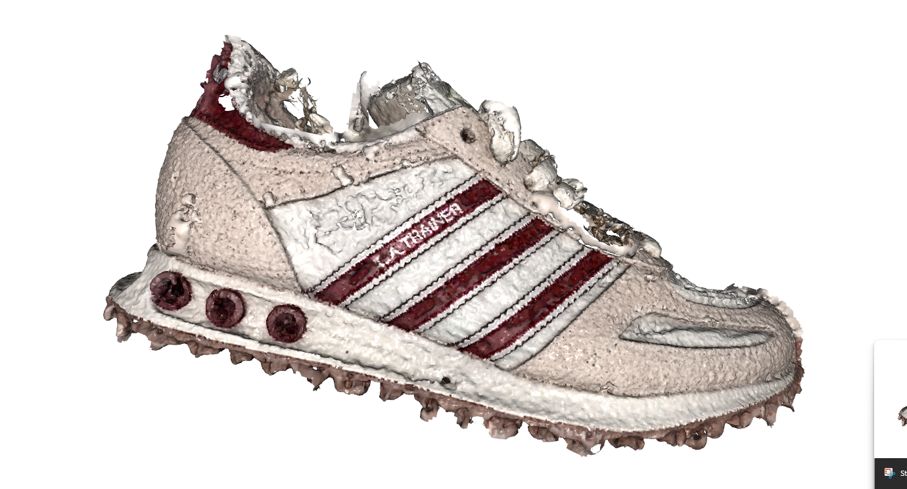
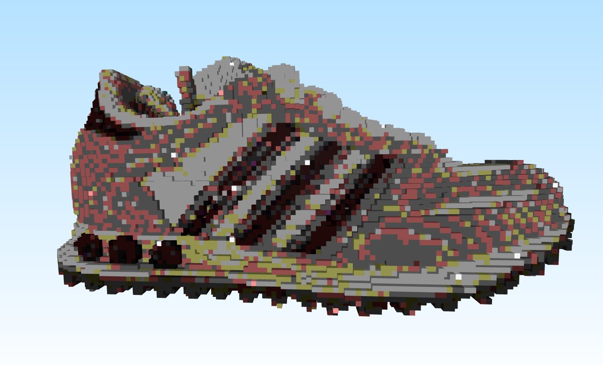

# 3D Gaussian Splatting Interactive Demos

This repository contains a collection of interactive scripts and physics simulations built on top of 3D Gaussian Splatting (3DGS). By combining PyTorch-based rasterization with Taichi-based physics engines (like Rigid Body and MPM solvers), these demos allow real-time deformation, fracture, cutting, and relighting of photorealistic 3DGS scans.

## Demos & Scripts

### Standard PLY Viewer (`ply_viewer.py`)
The baseline photorealistic viewer. It can be used to examine `.ply` scans in pristine, high-resolution quality with a free-look camera before processing them through the physics engines.

<p align="center">
  <video src="https://github.com/user-attachments/assets/b96b2b1c-9fa9-4fbe-894b-a9828af40cbc" autoplay loop muted playsinline width="600"></video>
</p>


### Material Point Method (Soft Body) Simulator (`physgaussian_mpm.py`)
Utilizes a CUDA-accelerated MPM (Material Point Method) solver to simulate complex elastoplastic materials. It allows turning a 3D scan into jelly, snow, or soft rubber that squishes, bounces, and tears dynamically.
<p align="center">
  <video src="https://github.com/user-attachments/assets/39331002-f64b-4e4b-8c7d-ae585cb1b33a" autoplay loop muted playsinline width="400"></video>
    <video src="https://github.com/user-attachments/assets/d260d162-682d-4796-aa9d-e25c85fa73cc" autoplay loop muted playsinline width="400"></video>
    <video src="https://github.com/user-attachments/assets/3dd06c97-cc32-48a4-8210-34811d818588" autoplay loop muted playsinline width="400"></video>
</p>

### Dynamic Relighting (`relighting.py`)
An editor focused on visual fidelity and scene lighting. This script allows manipulating point lights and ambient lighting, simulating real-time specular highlights and shadows on the Gaussian splats.
<p align="center">
  <video src="https://github.com/user-attachments/assets/7f872768-2554-4e0c-9183-9db7bd58d1b0" autoplay loop muted playsinline width="400"></video>
</p>

### Rigid Body Physics Simulator (`rigid_body.py`)
This script turns static 3DGS scenes into fully interactive rigid bodies. It automatically generates a collision proxy mesh (convex hull) and drops the object into a real-time physics environment, reacting to gravity, collisions, and the floor.
<p align="center">
  <video src="https://github.com/user-attachments/assets/2e4971b7-2227-4b96-a6eb-fc408c918dcc" autoplay loop muted playsinline width="400"></video>
</p>

### Laser Cutter (`laser_cutter.py`)
An interactive, mouse-driven laser cutting tool. By clicking and dragging the middle mouse button across the object, a ray is cast into the scene that physically disables and cuts away Gaussians, allowing slicing of the 3D scan in real-time.
<p align="center">
  <video src="https://github.com/user-attachments/assets/078a1e29-5a66-4fdb-837e-fe58ab609930" autoplay loop muted playsinline width="400"></video>
</p>

### Effects (`effects.py`)
A sandbox environment for manipulating the raw properties of the Gaussian splats (scales, rotations, spherical harmonics) to achieve various visual effects and distortions natively on the scan.
<p align="center">
  <video src="https://github.com/user-attachments/assets/de7edbc4-f056-4fd2-940b-347cb55b17ce" autoplay loop muted playsinline width="400"></video>
</p>

### Mesh and Voxel Converters (`ply_to_mesh.py`, `ply_to_vox.py`)
Utility scripts used by the physics engines to downsample the massive 3DGS point clouds into manageable proxy meshes (via Alpha Shapes/Convex Hulls) or Voxel grids for efficient collision detection.

<p align="center">
  
  
</p>


## Setup Guide

Follow these steps to set up a Python environment and start running the interactive scripts:

### 1. Download the models

The `.ply` models used in these demos can be downloaded from this [Google Drive folder](https://drive.google.com/drive/folders/15RpXtqiyZotGp-s0-QJX64ord3uitcaR?usp=sharing).

### 2. Create a Virtual Environment
It is highly recommended to use a Python virtual environment to manage dependencies locally. From the root directory of this project, run:
```bash
python -m venv venv
```

### 3. Activate the Environment
The environment must be activated every time before installing packages or running the simulations.

- **Windows:**
  ```bash
  .\venv\Scripts\activate
  ```
- **Linux/macOS:**
  ```bash
  source venv/bin/activate
  ```

### 4. Install Dependencies
With the virtual environment active, install all required packages (including PyTorch, Taichi, and `diff-gaussian-rasterization`) using the provided `requirements.txt`:
```bash
pip install -r requirements.txt
```

### 5. Running the Scripts
Once everything is installed, any individual demo script can be executed directly via Python. Ensure the environment is active, then run:
```bash
# Example: Run the rigid body physics demo
python rigid_body.py
```
